<div align="center">

# ⚡ AgentFlow AI

### AI-Powered Multi-Agent Workflow Automation Platform

Build, execute, monitor, and automate workflows using AI agents with seamless integrations including Gmail, Google Sheets, Slack, and Discord.


</div>

---

# Overview

AgentFlow AI is a modern workflow automation platform that enables users to create, manage, and execute intelligent workflows through a visual interface. It combines AI orchestration with third-party integrations to automate repetitive business processes while providing real-time execution tracking and notifications.

The platform includes authentication, workflow management, execution monitoring, integration management, secure credential storage, and configurable notification preferences within a production-ready dashboard.

---

# Key Features

- AI-powered workflow generation
- Visual drag-and-drop workflow editor
- Multi-agent workflow orchestration
- Gmail integration
- Google Sheets integration
- Slack integration
- Discord integration
- Manual workflow triggers
- Real-time execution monitoring
- Workflow execution timeline
- Dashboard analytics
- Secure authentication using JWT
- Encrypted credential management
- Browser notifications
- Email notifications
- User profile management
- Theme preferences
- Workflow versioning
- OAuth integration
- API health monitoring
- System diagnostics
- Responsive UI

---

# Tech Stack

## Frontend

- React
- React Router
- Tailwind CSS
- Framer Motion
- React Flow
- Axios
- Socket.IO Client

## Backend

- Node.js
- Express.js
- MongoDB
- Mongoose
- JWT Authentication
- bcrypt
- Multer

## Integrations

- Gmail API
- Google Sheets API
- Slack API
- Discord API

## Deployment

- Vercel
- MongoDB Atlas

---

# Project Architecture

```
Client
   │
React Application
   │
Express REST API
   │
Authentication
Workflow Engine
Execution Engine
Notification Service
Credential Manager
Integration Manager
   │
MongoDB Atlas

External Services

• Gmail
• Google Sheets
• Slack
• Discord
```

---

# Application Screenshots

## Landing Page

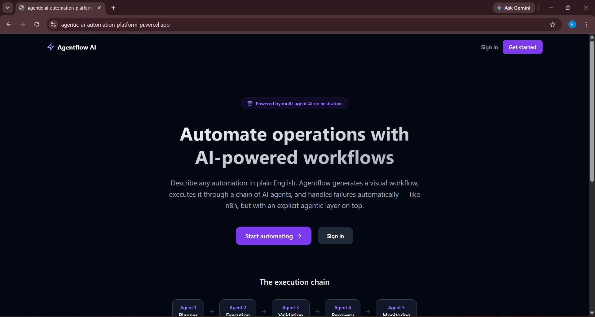

---

## Authentication

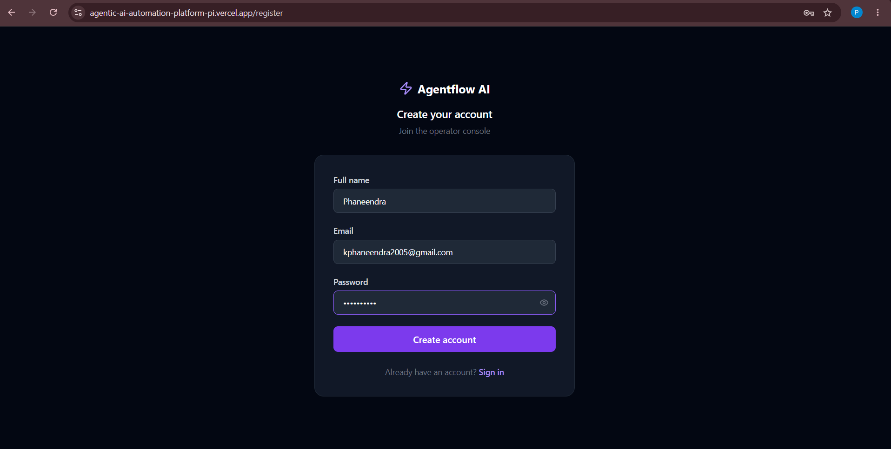

---

## Dashboard

Monitor workflow statistics, execution history, success rate, and recent activity.

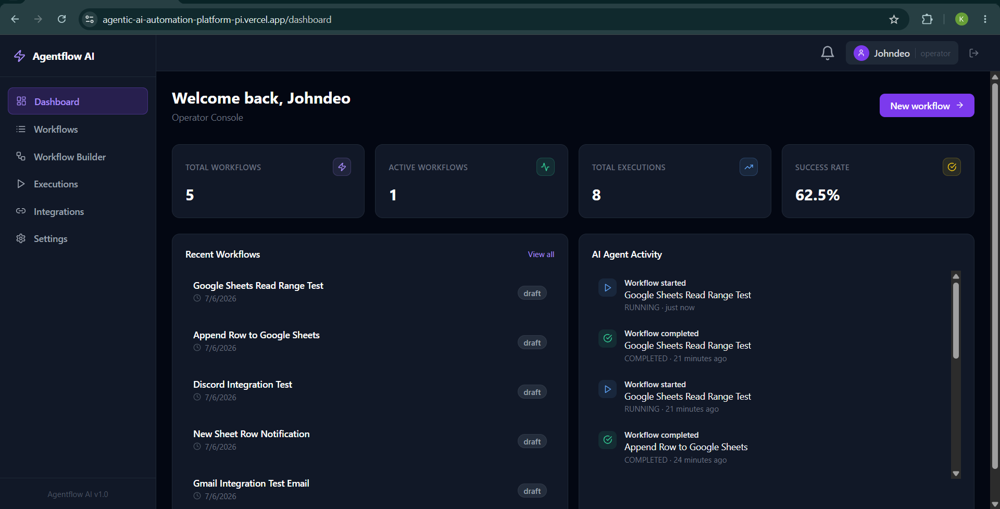

---

## AI Workflow Builder

Create workflows using AI-generated automation prompts.

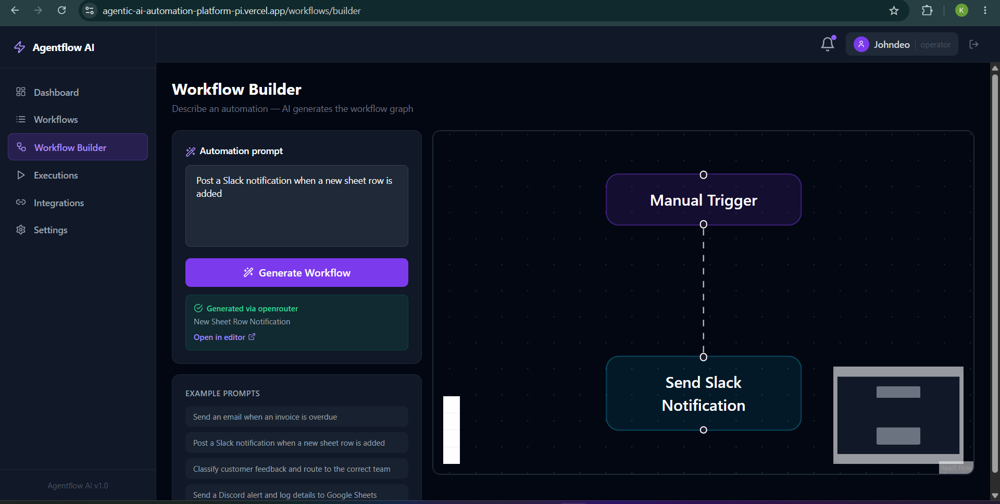

---

## Visual Workflow Canvas

Design workflows through an intuitive node-based editor.

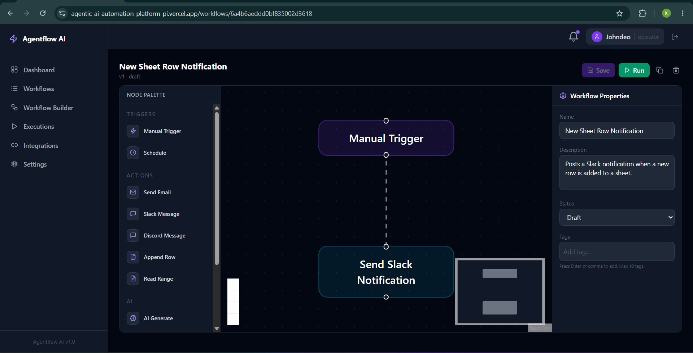

---

## Workflow Executions

Track workflow progress with detailed execution logs and agent timeline.

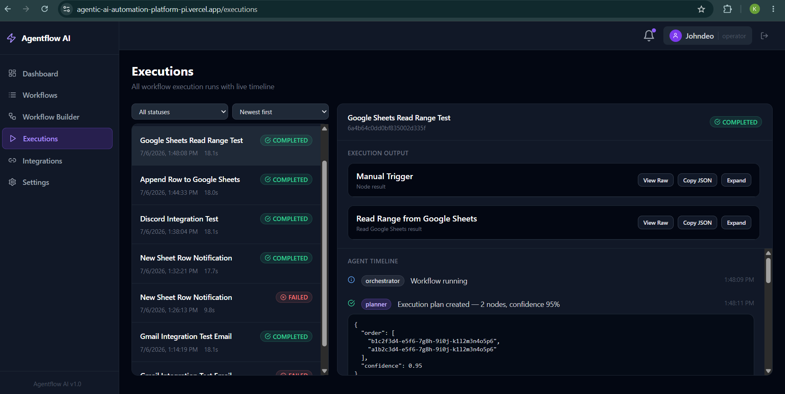

---

## Integration Management

Connect external services through OAuth.

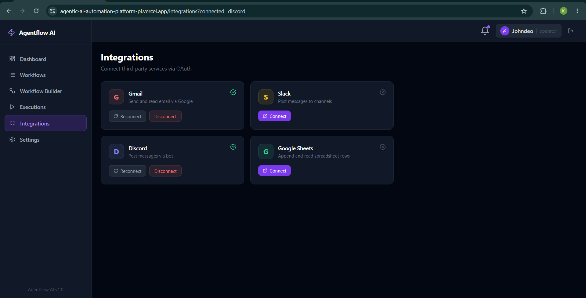

---

## Google Sheets Automation

Append rows and read spreadsheet data through connected workflows.

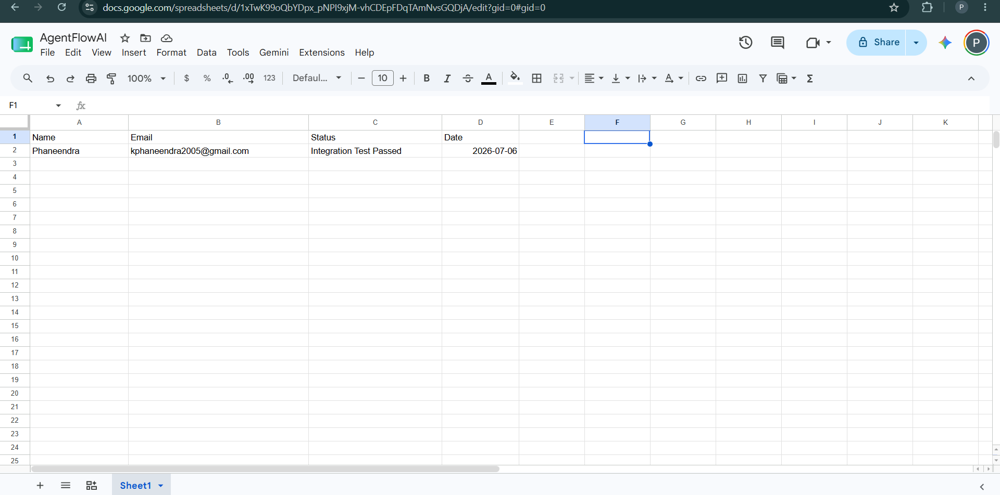

---

## Discord Integration

Send automated Discord notifications from workflows.

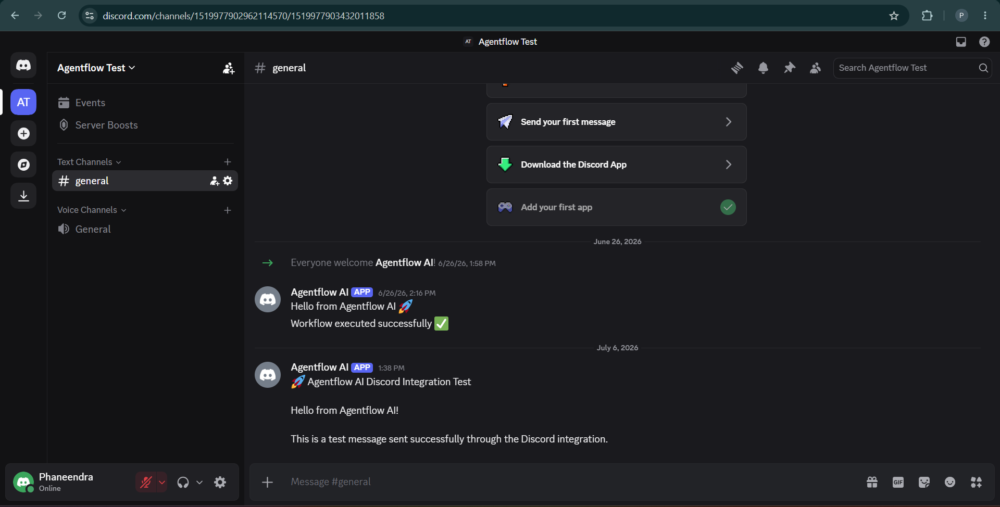

---

## Slack Integration

Post automated Slack messages through workflow execution.

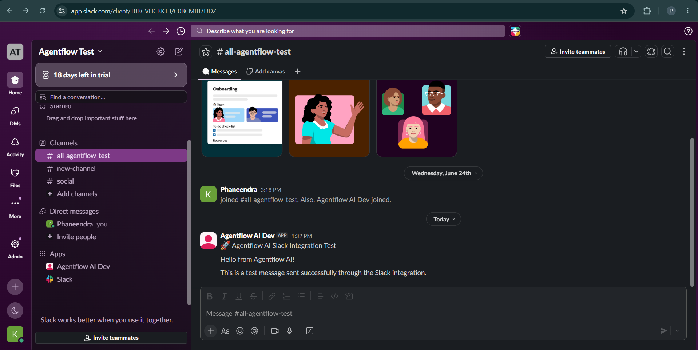

---

## Settings

Manage profile, password, notifications, API status, credentials, and system health.

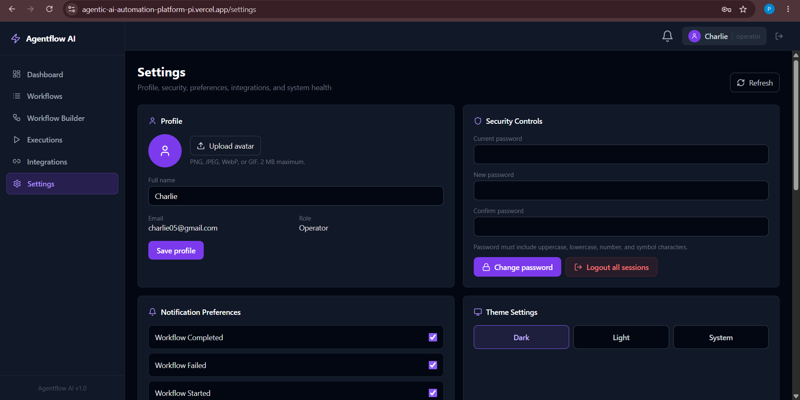

---

# Installation

```bash
git clone https://github.com/yourusername/agentflow-ai.git

cd agentflow-ai

npm install

cd client
npm install

cd ..

npm run dev
```

---

# Environment Variables

Create a `.env` file.

```env
PORT=

MONGODB_URI=

JWT_SECRET=

OPENROUTER_API_KEY=

GEMINI_API_KEY=

GOOGLE_CLIENT_ID=

GOOGLE_CLIENT_SECRET=

GOOGLE_REDIRECT_URI=

SLACK_CLIENT_ID=

SLACK_CLIENT_SECRET=

DISCORD_CLIENT_ID=

DISCORD_CLIENT_SECRET=

CREDENTIAL_ENCRYPTION_KEY=
```

---

# Core Modules

- Authentication
- Dashboard
- Workflow Builder
- Workflow Execution Engine
- Integration Manager
- Notification Service
- Credential Management
- API Monitoring
- System Health Monitoring
- User Settings

---

# Supported Integrations

| Integration | Status |
|------------|--------|
| Gmail | ✅ |
| Google Sheets | ✅ |
| Slack | ✅ |
| Discord | ✅ |

---

# Security

- JWT Authentication
- Password Hashing
- Encrypted OAuth Credentials
- Secure API Access
- Protected Routes
- Session Management

---

# Future Improvements

- Scheduled workflows
- AI workflow recommendations
- Marketplace for workflow templates
- Team collaboration
- Workflow sharing
- Webhook triggers
- Multi-workspace support
- Audit logs
- Analytics dashboard
- Mobile application

---

# Author

**Phaneendra Kanduri**

B.Tech Computer Science & Engineering (Cyber Security)

Full Stack Developer | AI Engineer

GitHub: https://github.com/yourusername

LinkedIn: https://linkedin.com/in/yourprofile

---

# License

This project is licensed under the MIT License.
